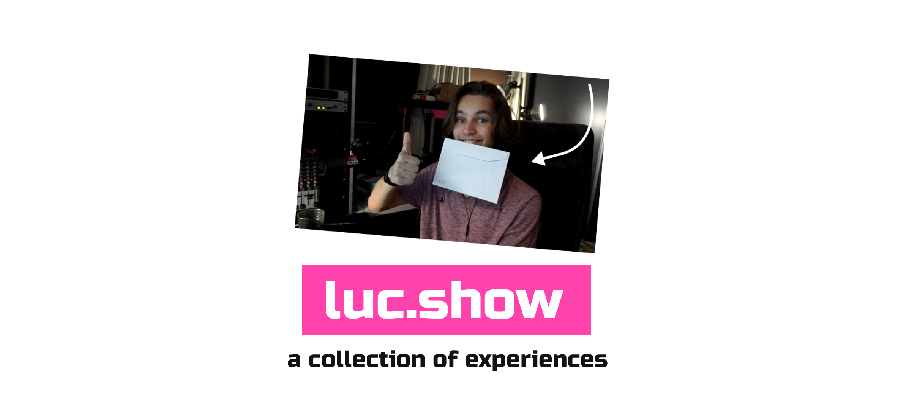
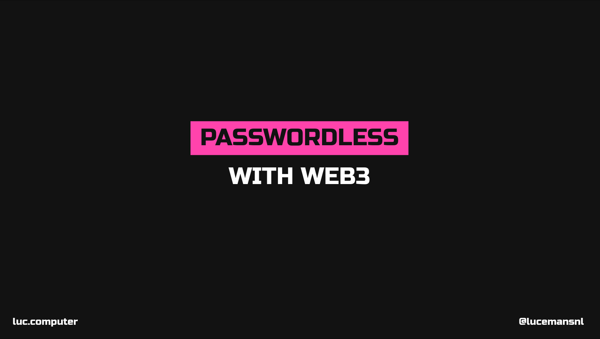

Welcome to luc.show, this repository is a mono-repo to store the plethora of slides, shows, related to all the things I do.

The current repository is set up like this.

<b>Table of Contents:</b>
- [show](#show)
- [web3-auth (slides)](#web3-auth-slides)
- [more](#more)

## show

The main index page hosted at <https://luc.show>. It is currently still heavily work in progress but ideally this page will show all of the shows and a description for each.

## web3-auth ([slides](https://luc.show/web3-auth/))

In our modern day and age, two-factor authentication has become the defacto standard for mosts sites these days. Wether it is signing up with your phone number, email-login-links or in-app push notifications.

As we have seen this shift I have become more and more fascinated with fully passwordless authentication, plug-and-play. While exploring the different passwordless authentication the web3 approach using public-key encryption and your ethereum wallet peaked my interest. In the session I run through web3 authentication, the history of the web, public-key authentication, and how to get it working in react.

This presentation was given during a [passionatepeople](https://passionatepeople.io) lunch & learn session.

## more

More to come :wink: